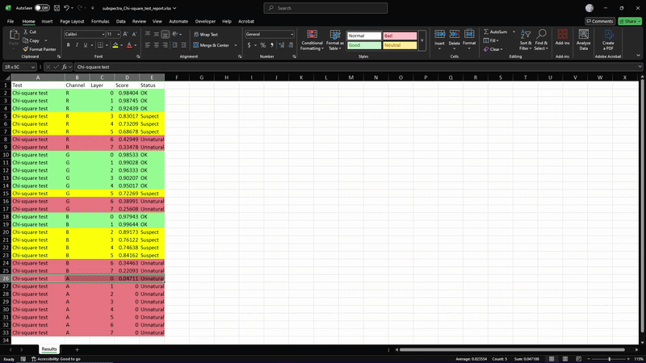
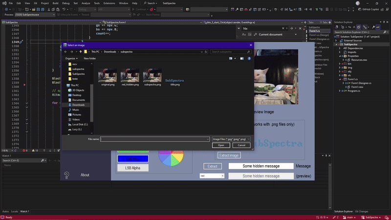

[](#) [](#) [](#)

**SubSpectra** is a Windows desktop app that hides and detects hidden messages in images and videos using **LSB steganography** and forensic statistical tests like **Chi-square** and **RS analysis**.

- Built with C# WinForms  
- Uses `FFmpeg` + `LibVLCSharp` for video  
- Exports Excel reports with verdicts  
- Includes visual filters and bit-level viewers  

---


---

## 🚀 Features

### 🔐 Hide Messages
- Embed strings in images (PNG, JPG) using R / G / B / A bit layers
- Embed 20-character messages in video center pixels (frame-by-frame)
- Preserve original audio during stego video creation

### 🔍 Detect Messages
- Chi-square and RS statistical tests on image & video data
- LSB bit-layer visualizer
- Excel reports with green/yellow/red status per test

### 🎨 Visual Filters
- Channel isolation (R, G, B, A)
- Gray, sepia, black & white
- Block-based smoothing (3×3 and 9×9)
- LSB bit removal


### 🧪 Forensic Testing
- Frame-by-frame analysis of videos (default is 50 frames)
- Tests multiple layers and color channels
- Color-coded Excel results for easy inspection



---

## 📂 Panels Overview

| Panel | Purpose |
|-------|---------|
| Panel 1 | Hide / Extract messages in images |
| Panel 2 | Hide / Extract messages in video |
| Panel 3 | Test image using Chi / RS & visualize layers |
| Panel 4 | Test video using Chi / RS |
| Panel 5 | Apply filters and remove bit layers |




---

## 🛠 Setup

1. ✅ Clone the repository
2. ✅ Open in **Visual Studio 2022+**
3. ✅ Restore NuGet packages:
   - `LibVLCSharp.WinForms`
   - `ClosedXML`
4. ✅ Ensure `ffmpeg.exe` is accessible (`ffmpeg_path`)
5. ✅ Build & run (`F5`)

💡 Requires `.NET Framework 4.8+`

---

## 📊 Sample Output

📁 Excel report example:
```plaintext
Test           Channel  Layer  Score      Status
Chi-square     R        0      0.91       OK
RS             G        1      0.54       Suspect
